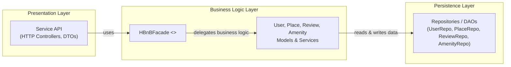
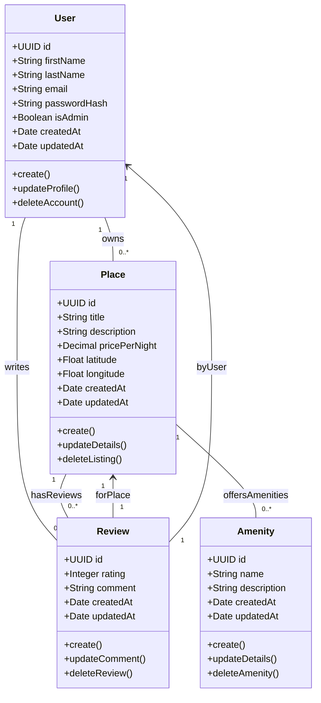
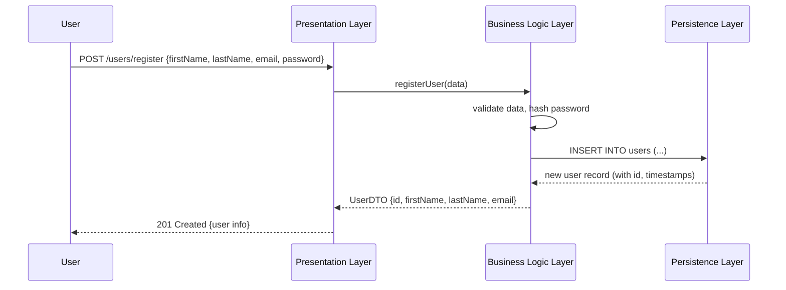
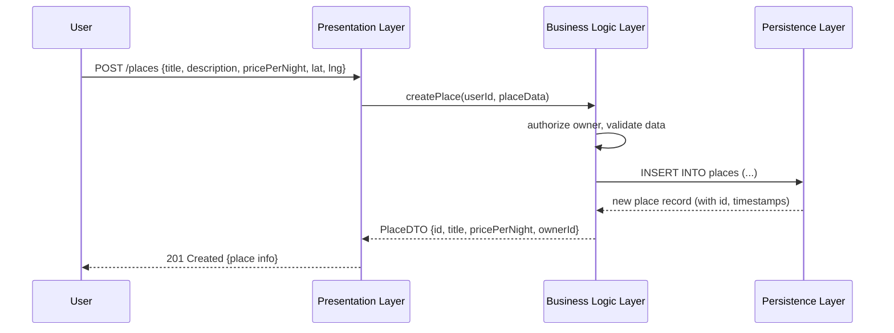
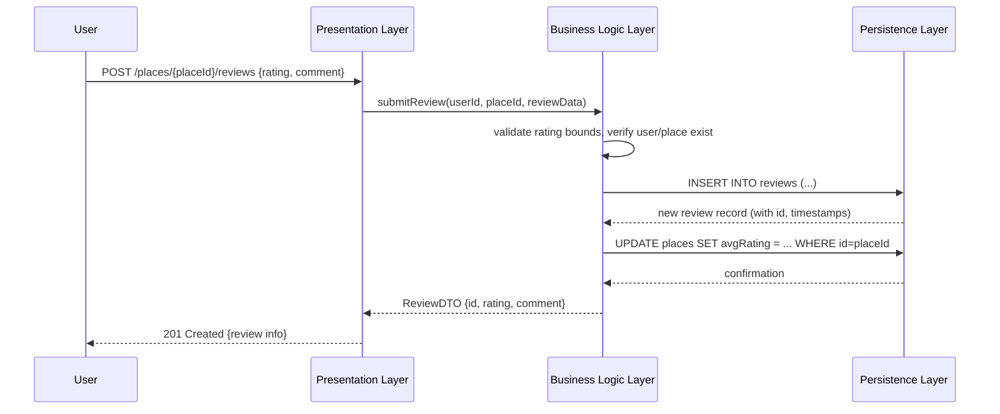
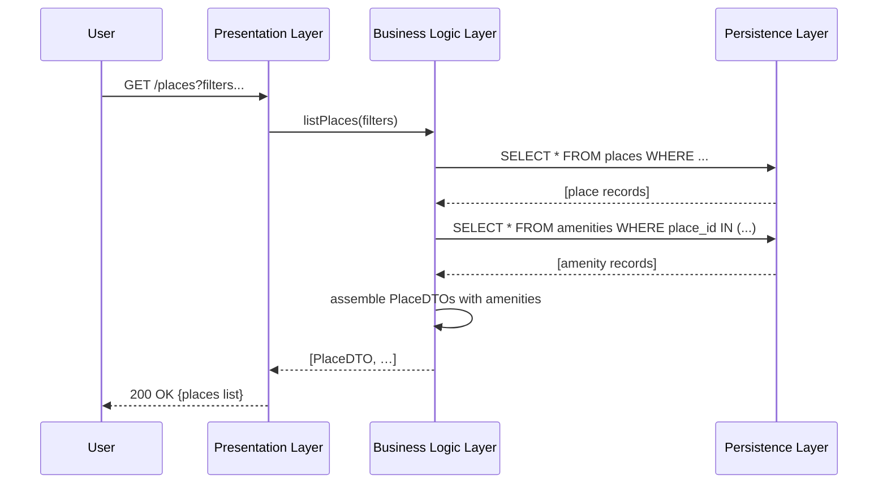

# HBnB Evolution: Technical Documentation

## Introduction

The HBnB Evolution application is a simplified AirBnB‑style platform enabling users to register, list properties, leave reviews, and manage amenities. This document consolidates the architectural and design artifacts needed to guide development, including:

- **High‑Level Architecture**: Layered package diagram illustrating the Presentation, Business Logic, and Persistence layers and their interactions via the facade pattern.
- **Business Logic Layer**: Detailed class diagram of core entities (`User`, `Place`, `Review`, `Amenity`), showing attributes, methods, and relationships.
- **API Interaction Flow**: Sequence diagrams for four key API calls (User Registration, Place Creation, Review Submission, Fetching a List of Places), detailing interactions across layers.

Each section contains the Mermaid.js diagram source and explanatory notes to clarify design decisions and data flows.

---

## High‑Level Architecture

### Package Diagram

### Explanatory Notes

- **Presentation Layer**: Exposes HTTP endpoints (controllers) and DTOs for input validation and response shaping. Depends on `HBnBFacade` to invoke business logic.
- **Business Logic Layer**: Contains the `HBnBFacade` interface, domain models, and services implementing core workflows (e.g., user registration, place validation).
- **Persistence Layer**: Houses repositories/DAOs abstracting database operations (CRUD) for each entity. Returns raw data to the business layer.
- **Facade Pattern**: Simplifies controller interactions by providing a single entry point (`HBnBFacade`) to orchestrate use cases, enabling loose coupling and easier maintenance.

---

## Business Logic Layer

### Class Diagram

### Explanatory Notes

- **Entities**:
    - **User**: Represents registered users (regular or admin) with profile attributes and account methods.
    - **Place**: Property listings with location, pricing, and lifecycle methods.
    - **Review**: User feedback tied to a place, including rating and comment lifecycle.
    - **Amenity**: Reusable service or feature attached to places.
- **Relationships**:
    - A `User` owns multiple `Places` and writes multiple `Reviews`.
    - A `Place` has many `Reviews` and can offer many `Amenities`.
    - Each `Review` is associated with one `User` (author) and one `Place` (target).

---

## API Interaction Flow

### 1. User Registration

**Notes**: Validates inputs and securely hashes passwords in the business layer before persisting.

### 2. Place Creation

**Notes**: Ensures only authorized users can create listings and enforces data constraints.

### 3. Review Submission

**Notes**: Maintains review integrity and updates aggregated ratings atomically.

### 4. Fetching a List of Places

**Notes**: Batches database queries for efficiency and composes full DTOs in business logic.

---

## Conclusion

This document unifies the architectural vision and detailed design of HBnB Evolution, from high‑level layering to low‑level interactions. It will serve as the definitive reference during implementation, ensuring consistency, clarity, and adherence to core design principles.

